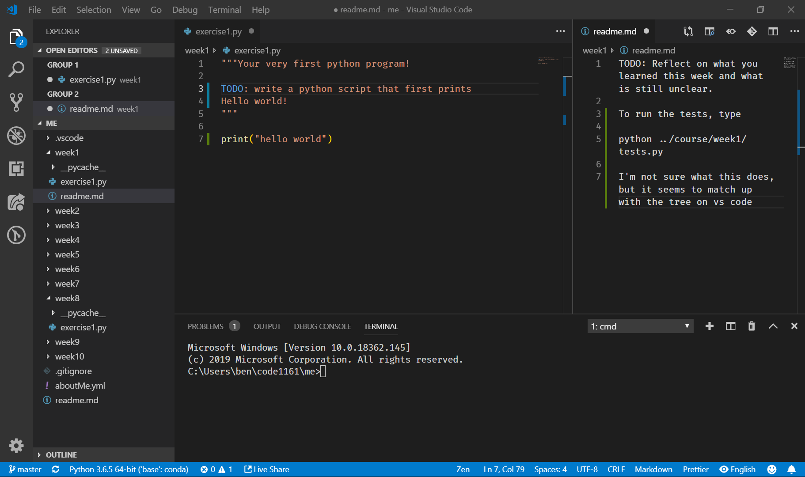
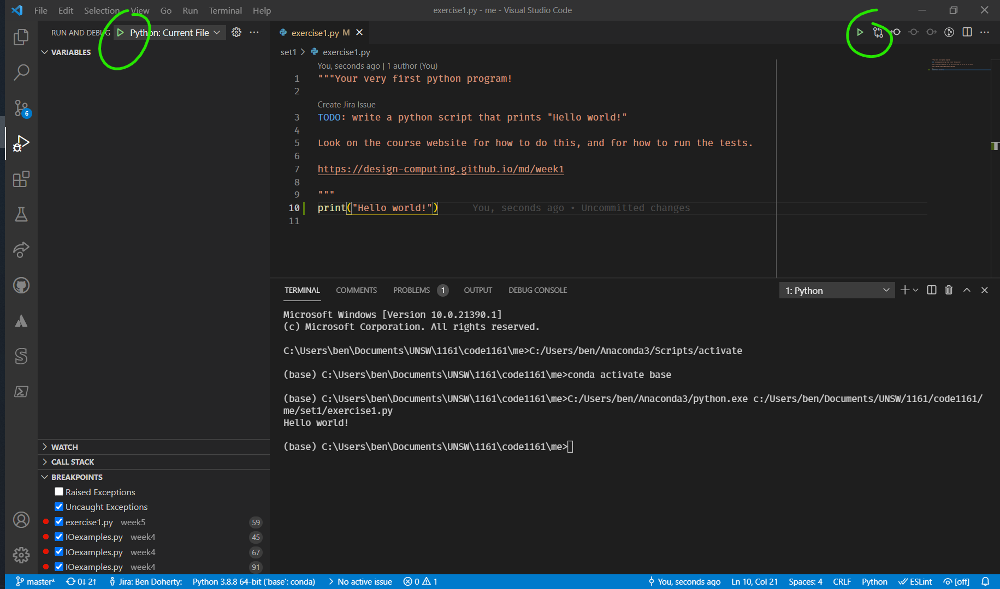
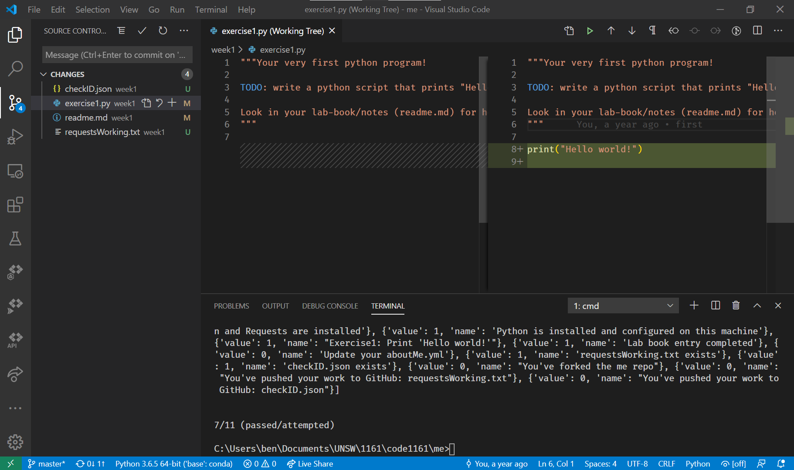
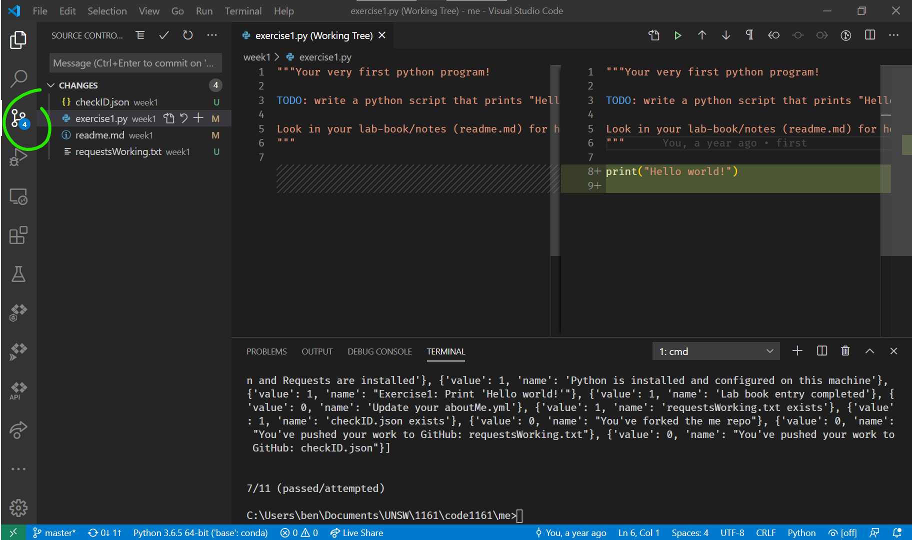
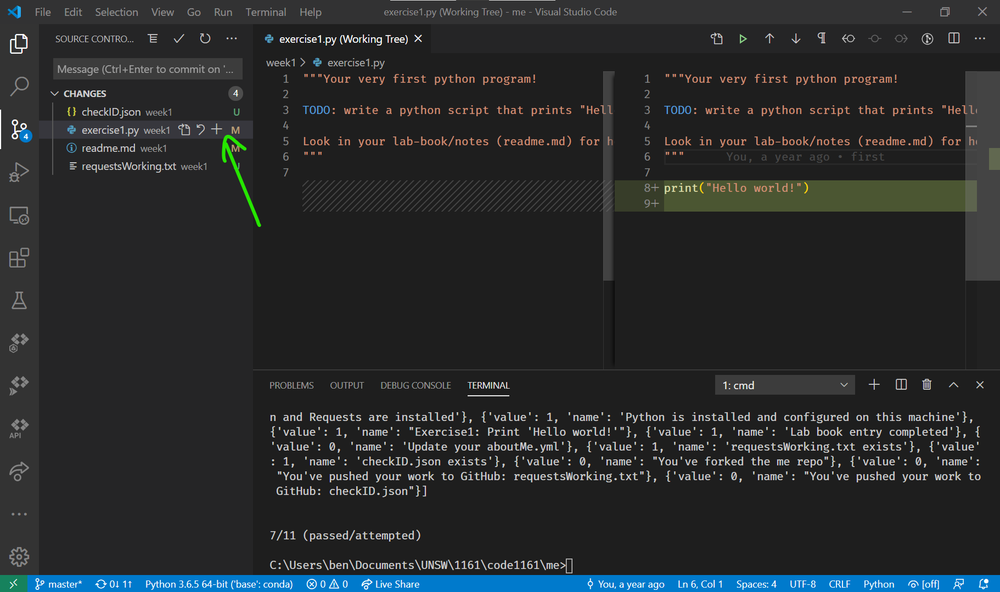
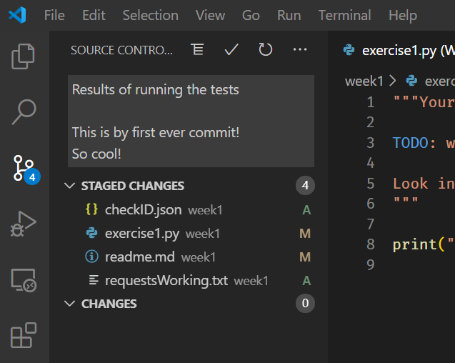
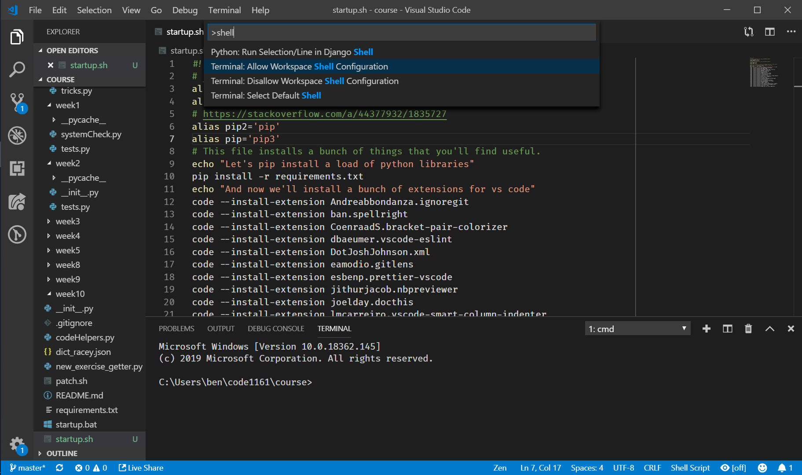
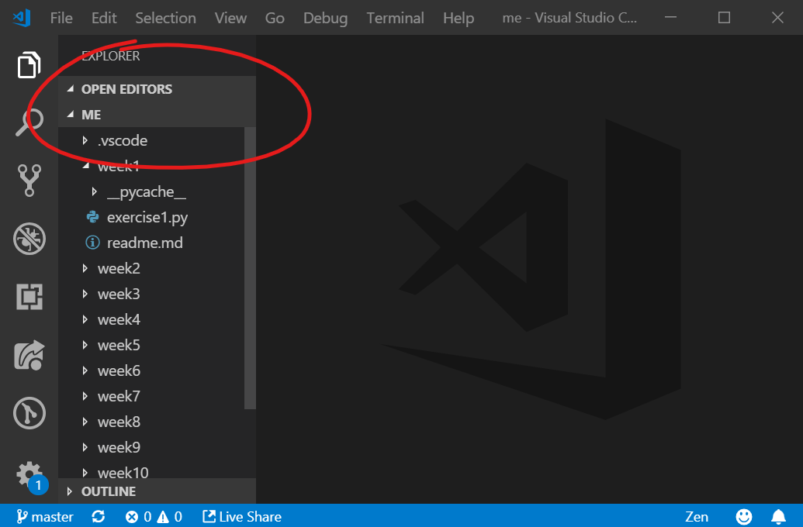

# Week 1 Lecture

Welcome to the first week of 1161!

This year, the lectures are online, so instead of a big chunk of lecture, it's broken up into little bits. This should make it easier to come back to if you need to.

we revisit a lot of the ideas mentioned in the lecture in the text below too, so try and absorb this page in one go. I know it's a lot, but you can do it!

<iframe width="560" height="315" src="https://www.youtube-nocookie.com/embed/NMbHLzQPYE8" title="YouTube video player" frameborder="0" allow="accelerometer; autoplay; clipboard-write; encrypted-media; gyroscope; picture-in-picture" allowfullscreen></iframe>

## Questions!

These questions are all anonymous. They're separate forms so that we can't tie the responses together. We'll talk about this kind of thing in one of the later lectures in this course.

Fill these in before we all come together in the lab please.

[Learning about you](https://docs.google.com/forms/d/e/1FAIpQLSdBZjEULRJh4CVWgfJhsGqQLNv7efpV82TxxyJpDrhYi5PpTg/viewform?usp=sf_link)

[What does _programming_ mean to you?](https://docs.google.com/forms/d/e/1FAIpQLSetpJp8n1CvvqSuZKs6YH-VQ0fRFGYx3jonDt-eHCMI9A85Ng/viewform?usp=sf_link)

[Why did you do this course?](https://docs.google.com/forms/d/e/1FAIpQLScwSwCPxFWixn_ioJM_YiR0DyKMAKsn0oqYEwH1Ad4Kia_sIQ/viewform?usp=sf_link)

### Competency, Concepts, Culture

<iframe width="560" height="315" src="https://www.youtube-nocookie.com/embed/pJapwX2ZX-s" title="YouTube video player" frameborder="0" allow="accelerometer; autoplay; clipboard-write; encrypted-media; gyroscope; picture-in-picture" allowfullscreen></iframe>

### Healthy programmers

<iframe width="560" height="315" src="https://www.youtube-nocookie.com/embed/ZLbMVox_J60" title="YouTube video player" frameborder="0" allow="accelerometer; autoplay; clipboard-write; encrypted-media; gyroscope; picture-in-picture" allowfullscreen></iframe>

### Self forgiveness

<iframe width="560" height="315" src="https://www.youtube-nocookie.com/embed/8mUojKcoHNs" title="YouTube video player" frameborder="0" allow="accelerometer; autoplay; clipboard-write; encrypted-media; gyroscope; picture-in-picture" allowfullscreen></iframe>

### Lab Book

<iframe width="560" height="315" src="https://www.youtube-nocookie.com/embed/CAFm-WMUngg" title="YouTube video player" frameborder="0" allow="accelerometer; autoplay; clipboard-write; encrypted-media; gyroscope; picture-in-picture" allowfullscreen></iframe>
<iframe width="560" height="315" src="https://www.youtube-nocookie.com/embed/qy6vv-wbtng" title="YouTube video player" frameborder="0" allow="accelerometer; autoplay; clipboard-write; encrypted-media; gyroscope; picture-in-picture" allowfullscreen></iframe>

### Who are we?

<!-- TODO: fill this in with the new 1161 tutor -->

<table>
<thead>
<tr>
<th>Ben Doherty</th>
<!-- <th>Alex Tohidi</th> -->
</tr>
</thead>
<tbody>
<tr>
<td><iframe width="400" height="315" src="https://www.youtube-nocookie.com/embed/K4eTMm4ruCs" title="YouTube video player" frameborder="0" allow="accelerometer; autoplay; clipboard-write; encrypted-media; gyroscope; picture-in-picture" allowfullscreen></iframe></td>
<!-- <td><iframe width="400" height="315" src="https://www.youtube-nocookie.com/embed/UfoJT6NZt5k" title="YouTube video player" frameborder="0" allow="accelerometer; autoplay; clipboard-write; encrypted-media; gyroscope; picture-in-picture" allowfullscreen></iframe></td> -->
</tr>
<tr>
<td>I've been working in the <em>computational design</em> world for over 15 years. You can <a href="https://notionparallax.co.uk/me">read more about me here</a>.</td>
<!-- <td>Talk with me about Data, Geometry, 3D printing & Robotic </td> -->
</tr>
</tbody>
</table>

### These are the slides

<iframe src="https://docs.google.com/presentation/d/e/2PACX-1vRdspBdIJjboJldPB4KTL-HtZ6sCtNkBvgfuUsd0d50ZNb7fheGMSuTAZ8MGVeMi3QDbXEvWa5troYh/embed?start=false&loop=false&delayms=3000" frameborder="0" width="960" height="569" allowfullscreen="true" mozallowfullscreen="true" webkitallowfullscreen="true"></iframe>

# Week 1 Lab: Python and Your Dev Environment

## Lab

<iframe src="https://docs.google.com/presentation/d/e/2PACX-1vQFMw9WsAuZ43GoF3OGs1pCJq1NzEEgpp1GknWwRrFq1_qizdkPGAPZ-5Ar2mkDwkpflIWv0n2n6KLj/embed?start=false&loop=false&delayms=3000" frameborder="0" width="960" height="569" allowfullscreen="true" mozallowfullscreen="true" webkitallowfullscreen="true"></iframe>

## Introduction

This week's lab is in two parts. One's administrative and the other's creative. But don't let that lull you into thinking that the first part is boring! Managing your dev environment is something you'll keep doing for your whole career. (_dev_ is short for _development_.) You can think of it like a chef choosing and sharpening their knives&mdash;it's a never ending process.

Part one will involve a lot of doing things without really knowing why. It'll be confusing, but it will get you going, then you can look back and understand. This part is a _lot_ of work, if it all goes well you might finish in 20 minutes, if not, it might take the whole session. It's important that you get this working because it's the core of the whole course. Don't leave until it's done, be persistent in asking for help if you're not sure or if it isn't working.

Part two is a low-barrier-to-entry way to start flexing your computational thinking.

There will be some bits where you're waiting around for something to download, so you can do both parts in parallel.

---

# Part 1

**IMPORTANT! DON'T LEAVE THE LAB UNTIL YOU HAVE FINISHED THIS SECTION!**

## Your dev environment

Part of your dev environment is going to be on your computer, and some of it will be in the cloud.

You'll hear us use the word _local_ to mean _on your computer_ and _remote_ to mean _in the cloud_.

### Cloud service accounts

**But first:** You might have an email address that's like `unicorn.sparkles@gmail.com` or `i_am_so_cool03@hotmail.com`. If you do, think about writing that on your CV. Do you want Norman Foster to read that?

Your email address, for better or worse, is your central identity. **Don't** use your university or work email address to sign up for things! You will still be using your GitHub account long after you've severed ties with that organisation. Get a good personal email address, and look after it.

If you're not sure if you've got a good email address, (or GitHub user name) ask me what I think.
<!-- TODO put new tutor name in here -->

#### Get a GitHub account!

1. Go to [github.com](https://github.com/) and **Sign Up**. The same advice about not making your email address embarrassing applies to your github username. Imagine that you're 40, you're the CEO of a major company and having to tell someone that your github user name is <code>eat_a_bag_of_clicks</code> or, even worse <code>z123456</code>. 🤮☹️😾😡😖
2. Fill in your real name
3. Upload a photo of your face as your profile picture. We need this so that we can work out who you are.

#### Get a StackOverflow account!

1. Go to [stackoverflow.com](https://stackoverflow.com/) and **Sign Up**.

You'll need this to help you out. As a way of 'paying' for that help, it's good manners to upvote the questions and answers that you find useful. Being a programmer without <abbr title="Stack Overflow">SO</abbr> is unthinkable!

### Steps to set up your dev environment

First we need to download some software:

#### Get software

1. **VS Code**

   This is the main tool you'll be using in this course. Almost everything happens from within VS Code, so learn to love it.

   1. Download VS Code from [code.visualstudio.com](https://code.visualstudio.com/)

1. **Python**

    This is the actual programming _language_.

    Go to [python.org/downloads](https://www.python.org/downloads/) and get the version that it reccomends (in the yellow button, right now that's 3.10.4, but get whatever is the newest.)

    This is the only installation that you might get stuck on, so pay attention.

    Open the installer, and tick the box at the bottom that says _Add Python to PATH_ ✅

1. **Git**

   Git is a version control tool. We're going to use it to make sure that your work is saved, backed up, and versioned. This means that you can go back to this morning without needing to save lots of copies with names like `my_work_final.py` and `my_work_final_final.py`.

   1. Go to [git-scm.com](https://git-scm.com/downloads) and download the latest git
   1. Install git with all the default values, except make **VS Code** be the default editor if you're asked.

#### Pull in the course resources

I've you've been doing this before the class as prep, stop here! (We might still be working on them!)

1. Open VS Code, bask in its glory
1. Inside VS Code, type [ctrl]+[\`] that's a backtick, it's to the left of `1` on most keyboards.

   

   That will pop up a section at the bottom of the screen. We'll call that your _terminal_.

   **Note**: when I say [key]+[other key] I mean to press both of those keys. Like to copy [ctrl]+[c].

1. Your prompt should say something like:

   `C:\Users\ben>` except where mine says `ben` yours will say something else, maybe it'll be your name, maybe it'll be something boring?

   Whatever it is, now we need to write some magic spells. 🧙‍♂️

1. Getting your content

   1. Make sure you're in a good place. If you're in Windows you'll be in your user `C:\Users\ben>`, if you're on a mac it might look like this: `MacBook-Pro:~ ben$` but, you know, check.

   1. Type `mkdir 1161` &larr; This **m**a**k**es a new **dir**ectory called _1161_

   1. Then `cd 1161` &larr; This **c**hanges the **d**irectory to _1161_

   1. Then `git clone https://github.com/Design-Computing/course.git` This pulls down the course repository. Typing this is going to suck, so go [here](https://github.com/Design-Computing/course) and use the green button. Remember We are "NOT" forking the "Course Repo", just clone it. So if we change the repo during the course, you can pull down the changes.

1. Clone & Fork

   1. Go to [https://github.com/Design-Computing/me](https://github.com/Design-Computing/me) and [fork](https://help.github.com/en/articles/fork-a-repo) yourself a copy of the _me_ repo.

      🔥🔥🔥🔥🔥🔥🔥🔥🔥🔥🔥🔥🔥🔥🔥🔥🔥🔥

      **TIME OUT:** I make a lot of fuss about this in the lecture, but every year lots of people get stuck here. You _need_ to clone _your_ fork of the `me` repo, not the Design-Computing version. Be extra careful when you're doing this step. It'll pay off in the long term. I promise.

      In previous years I've done a bunch of magic to fix your upstream, but that took a lot of time that I could be helping other people. This year I'm going to burn it to the ground and start you again, so make sure you do this right this or you'll need to redo work.

      🔥🔥🔥🔥🔥🔥🔥🔥🔥🔥🔥🔥🔥🔥🔥🔥🔥🔥

   1. Then, back in the terminal `git clone https://github.com/`_your name_`/me.git` We talked about it in the presentation. Again, don't type this, use the green button

   1. Now type `dir` you should get something that looks like:

      ```
      C:\Users\ben\1161>dir

      01/06/2019  16:20    <DIR>          .
      01/06/2019  16:20    <DIR>          ..
      01/06/2019  16:20    <DIR>          course
      01/06/2019  16:20    <DIR>          me
                  0 File(s)              0 bytes
                  5 Dir(s)  314,159,265,359 bytes free

      C:\Users\ben\1161>
      ```

   1. Now use `cd` (`c`hange `d`irectory) to move into the 'me' repo: type `cd me`

1. Finish up

   1. Last thing: type `cd ..` and then `cd course` and then `./startup.bat` and press [enter] this will install some libraries and extensions that will make your life easier/more fun. If you've got a Mac, call someone over to help.

1. Prepare your workspace.

   1. Get out a pen and notebook
   1. Take a deep breath
   1. Say "You've got this" to yourself
   1. Smile
   1. Go to `File`&rarr;`Open Folder` and then choose `me`
   1. Look at all those neat folders ready for you to work on!

1. Now you're ready to start the lab for real!

## My first programming

In this task you're going to do a full cycle of work.

1. Think
1. Test
1. Do
1. Save
1. Test
1. Commit
1. Push
1. Test

That's a lot to think about but it'll become easy soon. If we break that down individually:



This is how I set up my workspace for doing this kind of work. To split the screen, drag the tab all the way across to the right side of the screen.

#### Think


This is the _most_ important thing. Spending a long time doing the wrong thing is painful. _Thinking_ means discussing with your peers, drawing diagrams, closing your eyes and dancing out the steps. It's whatever helps you understand.

Each week has a folder. It'll show up in the tree view on the left. We're in week 1, so look in the folder `set1`.

We're interested in `exercise1.py` and `readme.md` I like to have them both open at the same time.

In `exercise1.py` look at the instructions in the _doc-string_. That's the bit at the top of the file.

```
"""Your very first python program!

TODO: write a python script that prints Hello world!
"""
```

Now do some thinking.

#### Test

<div style="float: right; display: block; width: 40%; padding: 1em; border: 12px solid yellow; background: aliceblue; margin-left: 1em;">
TIP: You can type a <code>../c</code> and then press [tab] and the terminal will _auto complete_ it to <code>../course/</code> then add a <code>s</code> and it'll finish that until the next unambiguous option: <code>../course/set</code>. If you keep going like this you can type all of that in just a few keystrokes. Learn how to do this, it's a superpower.
</div>

In this course the tests are already written for you. They check if your code does what it's supposed to do. To run the tests, you write, at the terminal:

> `python ../course/set1/tests.py`

Then press enter.

Resist the urge to copy and paste this, you're going to be doing it a lot, and it'll be much better if you learn to type it.

The tests produce a lot of output, so you'll want to pull up your terminal; there's an up arrow (**^**) on the right that makes it get much bigger.

Most of your tests will fail. This is good because you haven't done any work yet!

#### Do

Now you do the work! This is going to be a back and forth with Google, what we tell you in the lab, and conversations with yourself, your peers and your notebook.

#### Save

Save your work, it won't do anything otherwise.

You can tell if it's saved because the tab at the top of the file will show a &times; if it's saved and a `⚪` if it's not.

#### Test

<div style="float: right; display: block; width: 40%; padding: 1em; border: 12px solid yellow; background: aliceblue; margin-left: 1em;">
TIP: if you're on Windows, file paths have back slashes <code>\</code> but if you're on a mac, they have forward slashes <code>/</code>. This is really annoying because in programming, <code>\n</code> means newline, so paths that look like <code>..\nick\stuff\cool.py</code> get confusing. This is another example of choices made 40&ndash;50 years ago coming back to bite us in the bum. So you'll just have to be aware that it's going to be a problem whichever way you put the slash if you're in Windows.
</div>

Again, write, at the terminal:

> `python ../course/set1/tests.py`

Then press enter.

What did the tests say? What passed? What didn't?

The last two tests this week can't pass until you've pushed.

You'll usually want to actually run your code and see what happens, there are a couple of ways to do that.



1. The green ▶️ on the right runs the file you've got open in a simple way
1. The green ▶️ on the left runs the file you've got open with a debugger attached. You can get the same thing by pressing F5. We are going to talk a lot more about how to do this next week. This is just in case you're interested.

#### Commit

Once you've made some changes you can _commit_. It's like a save game that you can come back to. Deciding what a meaningful unit of change is to commit is up to you, but I commit a lot. I wouldn't usually go more than half an hour without committing.

We're going to talk about git and commits a lot more in the coming weeks, but for now, just follow the steps.

1. First thing you need to do is tell git who you are. Type\* these two commands into your terminal.

   ```
   $ git config --global user.email "email@example.com"
   $ git config --global user.name "Ben Doherty"
   ```

   Three things:

   1. You need to change `email@example.com` and `Ben Doherty` to your email and name. Seems obvious, but you'll be surprised how many people don't!
   1. Whenever you see `$` you don't type it, it's a symbol for _this is going to go into your terminal_. (It'll make more sense to mac people.)
   1. **\*** when I say "type" I really mean "copy and paste". Any time that you can avoid typing, do. It's a good way to avoid errors introduced by sloppy typing.

1.  Once you've got the test that relates to printing _Hello world!_ to pass you'll see that you get a number on the left toolbar, it'll probably be 4. That's the number of files that have changed. 3 of them are generated by me to check that your python is installed properly.

1.  `Exercise1.py` is your file. Click on the _version control_ icon, and then on `Exercise1.py`. It'll show you your change, highlighted in green (green for additions, red for deletions)

1.  Click the `+` to add the file to the staging area.

1. 

   Once you've added all the files, write a commit message.

#### Push

Once you've made a commit (or lots of commits), click the `...` three dots to get the menu. Find _Push_ and click it. Frustratingly, there are two sets of `...` three dots, and the one we want is invisible until you put your cursor over it. It's just underneath the set of dots that's actually visible. _ARGH!_

Wait for the incredibly subtle indicator to stop moving, then...

##### Alternatively, push from the command line

I've you can get down with a bit of typing, I think it's _much_ better to type `git push` into the terminal. It's less fiddly, and you also get much more feedback about whether is has worked or not.

#### Test

Hopefully, for the last time, write, at the terminal:

> `python ../course/set1/tests.py`

Then press enter.

What happens? Do you need to go back a few steps and have another go? If you can get a full suite of green ticks, then move onto Trinket

### `aboutme.yml`

One of the tests checks that you have filled in your `aboutme.yml`. I need this so that I can join up your GitHub account and your student number. So when you push your work to GitHub and we mark it, we know who has done the work. If you don't give us the information, the _repo_ has marks, but _you_ don't.

The information is in your `me` repo, the file is `aboutMe.yml`. Mine looks like:

```yml
name: Ben Doherty
studentNumber: z1234567
officialEmail: b.doherty@unsw.edu.au
contactEmail: # don't add anything to this line
  firstBit: ben # the indent is important, as is the space after the :
  otherBit: notionparallax.co.uk # this avoids spam, the @ is implied
# accounts
stackOverflowLink: https://stackoverflow.com/users/1835727/ben
github: notionparallax
```

The `contactEmail:` line is blank because it's before an indented block. That'll all make sense by the end of this week, but for now, go with it. (if you want to read more about YAML, [here's a link](https://en.wikipedia.org/wiki/YAML))

Update the file with your info, save, stage, write a good message, commit, and push. Then wait 30 seconds and check if your info shows up on the [website](https://design-computing.github.io/). Then run your tests again and check that that test passes now.

## Then: Trinket

Computing is mainly a mindset, not a typing skill. That mindset doesn't really care about languages. Programmers love to argue about which language is better, but in reality they have more in common than you'd think. The ideas cross boundaries.

Syntax, the way we type letters to make words and symbols, easy to get wrong. Let's start with an environment that makes the syntax easier.

Have a play with [trinket.io](https://hourofpython.trinket.io/from-blocks-to-code-with-trinket#/blocks/dragging-and-dropping), follow the tutorial, or just try making the first letter of your name with a turtle, or even both!

Put a link to your trinket results into your lab book (readme.md file).

You'll need to sign in, and then make a new trinket, using the _blocks_ option.

### Homework

- Make sure that you have your dev environment set up.

- In the set1 folder, complete: `exercise1.py`

- Write your journal in README.md

  Check out [maining Markdown](https://guides.github.com/features/maining-markdown/) for an intro to how formatting works in markdown (`.md`) files.

- That means that if you kept up in class, no coding homework this week! It's a great chance to read some of the articles below. They won't teach you python, but they _will_ broaden your mind. Each week there are some suggested readings, pick one, read it, and write some thoughts in your journal.

In theory, you can't get a full set of green ticks without everything going right. (If you can prove me wrong, I'd love to know about it!) If you get all the ticks, then you have finished your homework. _Don't_ leave class if you don't have a full set of green ticks

# Clinic

Getting the basics right is the key to being able to do this course. It's vital that you finish week 1's work or you'll struggle with the rest of the course.

What if you didn't manage to get everything working? **_Clinic time_** I'll be hosting a clinic on Teams at 8pm on Tuesday evening (the 8th). I'll post details on Monday.

### Readings

These aren't a part of your marks, but they'll give you a sense of the culture of this kind of work.

- **Graham, P.** (2009). _[Maker’s Schedule, Manager’s Schedule.](http://paulgraham.com/makersschedule.html)_
- **Case, N.** (2016). _[Simulating The World (In Emoji 😘).](http://ncase.me/simulating/)_
- **Davis, D.** (2015). _[Why Architects Can’t Be Automated.](http://www.architectmagazine.com/technology/why-architects-cant-be-automated_o)_ and **Doherty, B.** (2015). _[Architects getting automated?](https://notionparallax.co.uk/2015/architects-getting-automated)_
- **Noll, A. M.** (1967). _[The digital computer as a creative medium](http://noll.uscannenberg.org/Art%20Papers/Creative%20Medium.pdf)_. IEEE Spectrum, 4(10), 89–95.

# Are you a Mac user?

Some things are different for you. Here's what to do:

### First, get some things working

Make sure you have VS Code, Git and Python installed and working. You probably do already or you wouldn't know that things are astray.

You need to get a grasp of your file system. [This might be helpful to read](https://www.dummies.com/computers/macs/mac-operating-systems/basics-of-the-os-x-folder-structure/). I'll ask some mac people for advice on where to keep your `1161` folder. It doesn't _really_ matter, as long as you know where to find it.

To open a folder in Mac VS Code, there isn't a separate menu option, you just click _Open_ and then choose a folder instead of a file. This will make your version control work properly.

### The steps

1. You need to make VS Code be able to run as a command in your terminal.

   

   To do this, type [cmd]+[shift]+[p]. This will open the command pallet. Then type `shell` which will narrow the commands down to three or four. Then pick **Terminal: Allow Workspace Shell Configuration**. This now means that you can launch VS Code from inside the folder that you want it to launch in. E.g. if I'm inside my `Me` folder, then you can type `code .` and it'll launch, all ready to work.

1. You can't run `startup.bat` because `bat`s are only for Windows; you need a `.sh`. There's a file called `startup.sh` all ready for you to use. It should install a bunch of things, and set some aliases so that when you type `python` it knows what you mean. I haven't worked out how to make this work for your VS Code terminal, so you'll have to use your computer's terminal for the moment.

   - Click on the 🔍 next to the clock. Search for `terminal` and press enter.
   - A white window will open. If you type `pwd` it'll tell you where you are. Probably `/Users/yourName`
   - If you followed the instructions, then you put your `1161` folder here. Type `ls` and look for it.
   - If it's there, great. If not, grab a tutor. Actually, if anything in these instructions breaks, grab a tutor. Assuming that it _is_ there, then type `cd course`
   - type `git pull` and press enter
   - A little bit of text will scroll past, it will tell you about what's changed in the repo since you were there last.
   - type `bash startup.sh` and press enter
   - A _lot_ of text will start scrolling past.
   - Wait for it to finish.
   - Close the terminal, and open a new one. ([cmd]+[n] if that's your kind of thing.)
   - Type `python --version` it should say `Python 3.7.3` or at least `3.`.
   - If it does say that, then you are set!

1. run your tests by opening the `me` folder in your mac terminal (the white one) and typing `python ../course/set1/tests.py` in the terminal.

   If that doesn't work, try `python`**_`3`_**`../course/set1/tests.py` to call the tests explicitly with python 3

### Why is this a problem anyway?

Macs come with python already, but it's 2.7, not 3.7. Going from 3.7 to 3.8 is a minor version change (I call it a "version bump"), but going from 2.x to 3.x is a major version change. In a major version change, there are breaking changes, which means that python 2.x can't handle our code. We need to change to 3.x so that it works. This is easy in windows where we don't need to worry about the old version of python, but on macs there's some confusion to clear up.

# General trouble shooting

## Git

To get a good grasp of how to use version control in VS Code, [this is a pretty good place to start](https://code.visualstudio.com/docs/editor/versioncontrol).

If your version control tab isn't showing a provider, check that you have your `me` folder open.



This means that the `me` folder is the active environment. There are fancy ways around this, but this is the easiest way to make it work.

If your git still seems to be totally broken, even if you're doing this, then you can try Zack's fix:

> The fix for the git problem on VSCode (windows only, haven’t checked if there’s a solution for it on Mac but Mac people had the same problem) was to get into the settings.json file (File&rarr;Preferences&rarr;Settings then scroll down until it says ‘edit settings.json’) and add:
>
> `"git.enabled": true;`
>
> `"git.path": "C:\\path\\to\\git.exe"`

I don't really know how this works yet because I haven't tried it myself.
