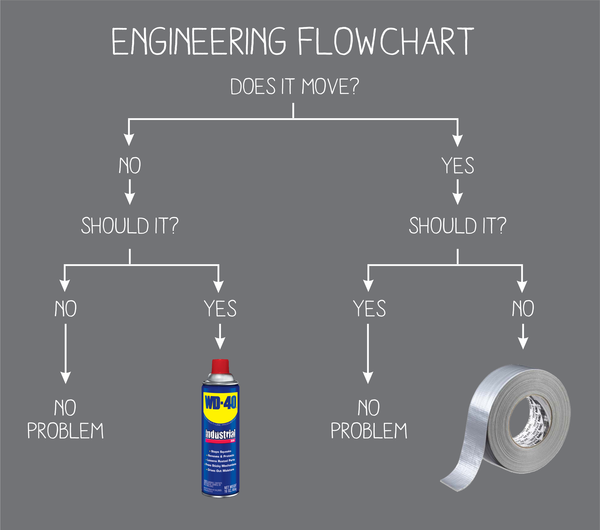

# Week 2 Lab: Everything Python in a few hours

## Introduction

- This week we will get an overview of all the components of the Python syntax. _Theoretically_, you will be able to do **any** programming task after this week.

- More details about your development environment.

- How to ask questions and the three step process to general problem solving.

Also, I've started a list of [useful commands and important words](useful_commands.md). If you want to add to it, you can make a pull request, or ask me to add to the list.

# Issues:

If you didn't get a suite of beautiful green ticks last week, then you need to talk to a tutor as soon as you can. That isn't many of you, so we're looking good for this week!

<iframe src="https://docs.google.com/spreadsheets/d/e/2PACX-1vThqcEHjsw4HBuZN5UPRlr7hzJMlVrgtv15u28NkF6ikzTJwILGZm-poYzjJaf3WFMauKjMPwSRRJgT/pubchart?oid=17662914&amp;format=interactive" style="width: 610px; height: 380px; float: right; margin-left: 2em;"></iframe>

This chart will show how many exercises you've got the tests passing for. If you're not on this list, then come and see me, if your name is in as a GitHub username and not a real name, then it's because your `aboutMe.yml` isn't fully filled in.

You will need to hover for all the names because embedded charts are annoying.

### Updating the tests

As we go through, there are new cases that we need to test for. For example, at the moment you can pass the lab book test by deleting everything in the `readme.md` file and saving it. It's not checking for empty files, only that you've changed the file. _However_ that won't always be the case, we'll update the tests when we find new reasons to. So what does this mean to you? Well, there's only one set of tests, the repo that holds your tests is the same one that holds my set. So if you want to make sure you're using the same tests as I am, you need to pull them down sometimes.

Assuming that you're in the `me` directory, to update the course to the latest version, you can copy and paste these commands into your terminal:

```powershell
cd ..\course                       # changes directory to the course directory
git pull                           # pulls the latest code down
pip install -r .\requirements.txt  # Installs the latest python modules
cd ..\me                           # puts you back into your me directory
python ..\course\set1\tests.py     # runs the tests to make sure you still pass everything
```

You should be able to paste that as a block and the terminal will figure it out. (flip the \ to a / if you're on a mac.)

This week's change checks that you've [changed your profile picture on GitHub](https://github.com/settings/profile).

### `Your Name`

Some people are still called _Your Name_. Let's fix that first!

Your name in the faces means that we can learn your names faster. It also means that when you push your work to GitHub and we mark it, we know who has done the work. If you don't give us the information, the _repo_ has marks, but _you_ don't.

The information is in your `me` repo, the file is `aboutMe.yml`. Mine looks like:

```yml
name: Ben Doherty
studentNumber: z1234567
officialEmail: b.doherty@unsw.edu.au
contactEmail: # don't add anything to this line
  firstBit: ben # the indent is important, as is the space after the :
  otherBit: notionparallax.co.uk # this avoids spam, the @ is implied
# accounts
stackOverflowLink: https://stackoverflow.com/users/1835727/ben
github: notionparallax
```

The `contactEmail:` line is blank because it's before an indented block. If you want to read more about YAML, [here's a link](https://en.wikipedia.org/wiki/YAML).

Update the file with your info, save, stage, write a good message, commit, and push. Then wait 30 seconds and check if your info shows up on the [website](https://design-computing.github.io/).

**One last tip**: Most of you have put your student number in as your email address. You also have the email address `firstname.lastname@unsw.edu.au` which is much nicer. You can find out what yours is by looking in your Outlook. It's not guaranteed, for example, Bronte Doherty isn't `b.doherty@unsw.edu.au` because that's me, ha, suck it Bronte! Feel free to update your about me whenever you like.

### `Readme.md`/Lab book

Each set/week has a lab book file already made for you. All you need to do is fill it in. It already has `TODO: Reflect on what you learned this week and what is still unclear.` in it, delete that and start writing.

Then you can write in the things you've tried and what happened. The instructions on how you use the debugger, or how to open a folder, or the nuances of a particular algorithm. Or how you feel today!

# Lecture&mdash;Let's learn some python!

You should probably watch these in the order I've posted them, but I'm not your dad, you do whatever you want.

## Python Syntax

<iframe width="560" height="315" src="https://www.youtube-nocookie.com/embed/wRLYYTGMXAs" title="YouTube video player" frameborder="0" allow="accelerometer; autoplay; clipboard-write; encrypted-media; gyroscope; picture-in-picture" allowfullscreen></iframe>

### Brackets! `{ } ( ) [ ]` 🦕🌿 🤜🤛 🤯

There are lots of brackets in programming. They all do different things, and you're going to have to learn them. Luckily there are only a few to get your head around.

| Type  | Names                           | Use                                                                                   |
| ----- | ------------------------------- | ------------------------------------------------------------------------------------- |
| `( )` | **Round brackets**, parentheses | Calling functions, defining tupels, wrapping line breaks, defining function arguments |
| `[ ]` | **Square brackets**, staples    | defining lists, indexing into all collections                                         |
| `{ }` | **Curly braces**, crab claws 🦀 | defining dictionaries, defining sets                                                  |

So, if we take the example from the lecture, and extend it a bit:

```python
my_List = [1, 2, 3, 4, 5]
my_dict = {"name": "Cake", "taste": "Delicious"}
my_tupel = (9, 8, "hello")
another_list = [my_dict, my_List, my_tupel]
```

Then if we print `another_list`, we get:

```python
print(another_list)
[
  {'taste': 'Delicious', 'name': 'Cake'},
  [1, 2, 3, 4, 5],
  (9, 8, "hello")
]
```

It's all very well making heterogeneous collections, but how do we get elements out of them? That's where indexing comes in handy.

All of the following examples are going to get things out of `another_list`:

| Target            | Code                      | Comment                                                                                                                |
| ----------------- | ------------------------- | ---------------------------------------------------------------------------------------------------------------------- |
| `[1, 2, 3, 4, 5]` | `another_list[1]`         | The whole list is the 1th thing in `another_list`.                                                                     |
| `5`               | `another_list[1][4]`      | We can stack indexing to get deeper into nested collections.                                                           |
| `"Cake"`          | `another_list[0]["name"]` | We use an integer to get the first item out of a list, then a string key to get a particular item out of a dictionary. |
| `"hello"`         | `another_list[2][2]`      | You use integer indexing to get elements out of tupels too.                                                            |

This is technically easy, but tricksy, it takes a while to remember the difference between integer and string indices for different collections, and 0 indexing still trips me up sometimes. Be patient, you'll get there.

Test yourself in an interactive session; how would you get `'Delicious'` out of `another_list`?

## Getting stuck into the exercises

<iframe width="560" height="315" src="https://www.youtube-nocookie.com/embed/8Nx-r5Vebys" title="YouTube video player" frameborder="0" allow="accelerometer; autoplay; clipboard-write; encrypted-media; gyroscope; picture-in-picture" allowfullscreen></iframe>

### How to do the exercises: vocabulary and concepts

Each file starts with a section of writing, wrapped in """triple quotes""". It tells you what the we want you to do. There's another one in each function that is more specific.

```python
"""Modify each function until the tests pass.

The command to run the tests this week is:

python ../course/set2/tests.py


In each function, where you see:

    the_answer = None

replace None with the actual answer.

"""
```

The block below is an example of a completed exercise function. It's made of

1. a _name_, `add_1`;
1. an _argument_, `a_number`;
1. a `"""docstring"""`;
1. some code in the _function body_;
1. with a `return` statement.

Take a look and I'll explain it all below.

```python
def add_1(a_number):
    """Return a number that is 1 bigger than number given.

    This isn't a trick!

    This is an example function to get you started.
    Run the tests now and this one should go green. Free marks!
    """
    the_answer = a_number + 1

    return the_answer
```

This is a good time to practice _reading_ the code. Read the code and try to decide what it'll do then you run it, or in programmer-speak, _call the function_.

- Question: What would we get if we called the function as `add_1(4)`?
- Question: What would we get if we called the function as `add_1(4)`?
- Trick question: What would we get if we called the function as `add_1("do ")`?

### Name

Like you have a name&mdash;that you've just added to your `aboutMe.yml` file&mdash;this function has a name too; it's `add_1`. You need to know a function's name to be able to _call_ it.

### Argument or Arguments

The function takes in some values to do something with. In this case the argument is called `a_number`. You can call it anything that's a [valid variable name](https://realpython.com/python-variables/#:~:text=Officially%2C%20variable%20names%20in%20Python,name%20cannot%20be%20a%20digit.).

People sometimes get confused about where the values come from. The argument name is an alias for the value that's _passed_ in.

If you were making a sandwich function, the code might be:

```python
def make_sandwich(filling):
  print( "==========\n"
        f" {filling}\n"
         "==========\n")
```


or in an even simpler example:

```python
def double(x):
  return x + x
```

When we a function to run, the programmer language for that is to "_call_" it, so if we _call_ these: `double(4)` gives `8` and `make_sandwich("cheese")` will print:

```
==========
  cheese
==========
```

The argument name wraps the incoming value so that you can think _abstractly_ about it.

Functions can have any number of arguments, including zero.

### `"""docstring"""`

The text in `"""triple quotes"""` is called the docstring; it's important in python functions because it explains what the function does, in human-readable language. to auto-documenters what your function does, and it also shows as context help in your editor.

### Code

This is the python that does the work. We'll learn a lot about this bit during the course.

### `return` statement

This is a _keyword_. If arguments put values in, `return` gives a value back.

```python
half_a_dozen = double(3)
```

`half_a_dozen` will end up as `6` because `double` has `return`ed that to it.

## Tests

<iframe width="560" height="315" src="https://www.youtube-nocookie.com/embed/6NCj4_tcroA" title="YouTube video player" frameborder="0" allow="accelerometer; autoplay; clipboard-write; encrypted-media; gyroscope; picture-in-picture" allowfullscreen></iframe>

## Git and GitHub

<iframe width="560" height="315" src="https://www.youtube-nocookie.com/embed/lTggFrwhL_o" title="YouTube video player" frameborder="0" allow="accelerometer; autoplay; clipboard-write; encrypted-media; gyroscope; picture-in-picture" allowfullscreen></iframe>

## How to ask questions

<iframe width="560" height="315" src="https://www.youtube-nocookie.com/embed/T1_W9sPKpgc" title="YouTube video player" frameborder="0" allow="accelerometer; autoplay; clipboard-write; encrypted-media; gyroscope; picture-in-picture" allowfullscreen></iframe>

## Editor Fu

<iframe width="560" height="315" src="https://www.youtube-nocookie.com/embed/9_pcdGOyZi4" title="YouTube video player" frameborder="0" allow="accelerometer; autoplay; clipboard-write; encrypted-media; gyroscope; picture-in-picture" allowfullscreen></iframe>

Here's the [VS Code shortcuts pdf](https://code.visualstudio.com/shortcuts/keyboard-shortcuts-windows.pdf) for Windows. If you're serious about being hardcore, print it out on an A3 page and put it up above your screen.

## Abstraction

<iframe width="560" height="315" src="https://www.youtube-nocookie.com/embed/DnjyiTL_oxI" title="YouTube video player" frameborder="0" allow="accelerometer; autoplay; clipboard-write; encrypted-media; gyroscope; picture-in-picture" allowfullscreen></iframe>

## The slides

You can flick through these at your own speed:

<iframe src="https://docs.google.com/presentation/d/e/2PACX-1vSEJTgnVfMDxqhq_GLux0lw4X3rWLM3cZk19otcxFgimTomh7dTq0Aq-D8aQuKqzaUMcE_01_ua-xpI/embed?start=false&loop=false&delayms=3000" frameborder="0" width="960" height="569" allowfullscreen="true" mozallowfullscreen="true" webkitallowfullscreen="true"></iframe>

---

### Engineering Flowchart

In exercise 3, the `fix_it` function asks about an engineeringFlowchart. This is it:



## Homework

1. Finish this week's exercises: 0&ndash;3. Remember to _push_ to GitHub. If you don't push, I won't know that you've done anything.

1. We're going to teach you python, we promise, but why not make the most of the rest of the world?

   Doing many tutorials on the same subject will explain ideas in different ways. The two we'd recommend are:

   1. [Automate the Boring Stuff with Python](https://automatetheboringstuff.com/#toc:): Do chapters 1&ndash;5

   1. [Codecademy: Learn Python 3](https://www.codecademy.com/learn/learn-python-3). This is paid content, but you can do it on a free trial. If you decide to stay, students get 35% off. [Learn python 2](https://www.codecademy.com/learn/learn-python) (This is python 2 it's free, but the content is basically the same.)

   These will give you different perspectives on this python stuff. The more times you cover the material, the better it'll bed down in your brain. Each person has different learning styles, and the more times you cover the material from different perspectives, the more robustly it'll stick in your brain.

1. Optional: Read _[The Oregon Trail Game: Crossing Rivers](http://www.died-of-dysentery.com/stories/crossing-rivers.html)_ and see if you can write the flow control (`if`, `elif` and `else`) statements that would give you the results in this image: . It's not going to be tested, it's more about stretching your thinking process.

## Optional Reading:

These aren't a part of your marks, but they'll give you a sense of the culture of this kind of work.

- **Bouchard, R. Philip**, _[The Oregon Trail Game: Crossing Rivers](http://www.died-of-dysentery.com/stories/crossing-rivers.html)_.

- **Victor, B.** (2011). _[Up and Down the Ladder of Abstraction](http://worrydream.com/LadderOfAbstraction/)_.

  A great read that will help you _think_ like a programmer.

- **Noll, A. M.** (1967). _[The digital computer as a creative medium](http://noll.uscannenberg.org/Art%20Papers/Creative%20Medium.pdf)_. IEEE Spectrum, 4(10), 89–95.

  A really old paper, people have been thinking about this stuff for a _long_ time now.

# The answers to this week's exercises

I made these videos for Atom, which is the editor we used before we switched to VS Code, but the ideas are the same, but it looks different.

The way of solving these problems is not _the_ correct way, it's _a_ correct way.

Don't mindlessly copy the results of these, think about what I'm doing, and why. For example, if you watch the first video, don't play along and roll straight into the second, see if you can use what you've learned to figure out the next problem _before_ watching the next video.

The aim here is for you to learn. It's pretty easy to cheat in this course and get a high mark, but that'll torpedo your chances of getting the base you need to succeed in future courses. You're here to _learn_, marks are there to keep your parents happy.

P.S. one of these videos has a mistake in it. I'll know if you're copying without thinking because that mistake will show up in your code. It's simple to avoid if you're paying attention.

<iframe height="400" src="https://www.youtube-nocookie.com/embed/uEf4zcsdpek?rel=0" frameborder="0" allowfullscreen>Should be a video here</iframe>

<iframe height="400" src="https://www.youtube-nocookie.com/embed/hEk7YZ42NSU?rel=0" frameborder="0" allowfullscreen>Should be a video here</iframe>

<iframe height="400" src="https://www.youtube-nocookie.com/embed/HcG-KNYF6Iw?rel=0" frameborder="0" allowfullscreen>Should be a video here</iframe>

<iframe height="400" src="https://www.youtube-nocookie.com/embed/Gh9BzNdVNc0?rel=0" frameborder="0" allowfullscreen>Should be a video here</iframe>

<iframe height="400" src="https://www.youtube-nocookie.com/embed/0BOc0AnQnwk?rel=0" frameborder="0" allowfullscreenShould be a video here> </iframe>

<iframe height="400" src="https://www.youtube-nocookie.com/embed/GbC3fd21uJU?rel=0" frameborder="0" allowfullscreen>Should be a video here</iframe>

<iframe height="400" src="https://www.youtube-nocookie.com/embed/TVtuEOW-KDU?rel=0" frameborder="0" allowfullscreen>Should be a video here</iframe>

<iframe height="400" src="https://www.youtube-nocookie.com/embed/JP1-tBDjpik?rel=0" frameborder="0" allowfullscreen>Should be a video here</iframe>

<iframe height="400" src="https://www.youtube-nocookie.com/embed/5rnLnkyCPW4?rel=0" frameborder="0" allowfullscreen>Should be a video here</iframe>

<iframe height="400" src="https://www.youtube-nocookie.com/embed/vmwL84h0FF4?rel=0" frameborder="0" allowfullscreen>Should be a video here</iframe>

<iframe height="400" src="https://www.youtube-nocookie.com/embed/8B8zK55emaM?rel=0" frameborder="0" allowfullscreen>Should be a video here</iframe>

<iframe height="400" src="https://www.youtube-nocookie.com/embed/heyFEgCl5vA?rel=0" frameborder="0" allowfullscreen>Should be a video here</iframe>

<iframe height="400" src="https://www.youtube-nocookie.com/embed/v3fjYZq3-jQ?rel=0" frameborder="0" allowfullscreen>Should be a video here</iframe>

<iframe height="400" src="https://www.youtube-nocookie.com/embed/wsHflhgIGpg?rel=0" frameborder="0" allowfullscreen>Should be a video here</iframe>
