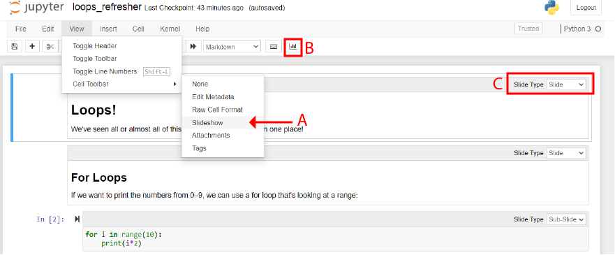

# How to present the data project

The presentations for the data project are in the regular class slot in week 11.

Don't make a separate slideshow in PowerPoint or Google Slides, there's a way of making presentations from inside your python file.

This is good because it's less work, but it _also_ makes your python file much better because it makes you explain it in a clearer way.

## The RISE of the web notebooks

Before you could do notebook python in VS Code, you did it in a web browser. This was a bit annoying, but it does have the advantage of some CSS goodness. It _also_ has a way to automatically make [reveal.js](https://revealjs.com/) slideshows.

### packages

To get started you need to install a couple of things:

```
pip install notebook RISE
```

This will install the `notebook` package and the `RISE` package.

### Getting going

Now you've got the packages, you can start the notebook. From the terminal, from inside your data project folder, type:

```
jupyter notebook
```



This will start a notebook server and then open a new tab in your browser. It'll take a couple of seconds to get your bearings, but this is exactly the same as your VS Code environment.

You need to tell your notebook that you want to be in slideshow mode. To do that go to `view`&rarr;`Cell Toolbar`&rarr;`Slideshow` (A). Then you should get a little dropdown in the top corner of all the cells (B).

To start the presentation, click the button with the barchart on it (C). You'll see all your cells bunched up on the first slide. Click the ✕ to get out of the presenation.

RISE presentations (really, it's reveal presentations) have sequential slides the same as PowerPoint, but they also have subslides.

| main point &rarr; | main point &rarr; | main point &rarr; | main point &rarr; | main point &rarr; |
| ----------------- | ----------------- | ----------------- | ----------------- | ----------------- |
| sub point         | sub point         | sub point         |                   | sub point         |
| sub point         | sub point         | sub point         |                   | sub point         |
|                   | sub point         | sub point         |                   |                   |
|                   | sub point         | sub point         |                   |                   |
|                   | sub point         |                   |                   |                   |

The best way to think about this is that you have some big points to make, and you also have some details to go into.

Each _main point_ should have _Slide_ in the top right hand corner, and each sub point should have _Sub-Slide_. If you want to hide something, select _Skip_.

_Skip_ can be very helpful if you have a cell that has a lot of graph construction on it. e.g.:

```python
platform_colours = {"Facebook": "blue", "Hangouts": "green", "Instagram": "orange"}
fig = plt.figure()
ax = fig.add_subplot(111)
for name, df in all_convo_df.groupby("platform"):
    ax.scatter(
        df.date, df.seconds, s=20, alpha=0.04, label=name, c=platform_colours[name]
    )
ax.yaxis_date()
fig.autofmt_xdate()
plt.title("All messages in and out, coloured by platform")
plt.ylabel("seconds after midnight GMT")
leg = plt.legend()
for lh in leg.legendHandles:
    lh.set_alpha(1)
plt.show()
```

That's more code than you can fit on a slide, let alone fit on a slide and show a meaningful graph. However, we can use a nice little hack:

```python
def show_messages_coloured_by_platform():
  platform_colours = {"Facebook": "blue", "Hangouts": "green", "Instagram": "orange"}
  fig = plt.figure()
  ax = fig.add_subplot(111)
  for name, df in all_convo_df.groupby("platform"):
      ax.scatter(
          df.date, df.seconds, s=20, alpha=0.04, label=name, c=platform_colours[name]
      )
  ax.yaxis_date()
  fig.autofmt_xdate()
  plt.title("All messages in and out, coloured by platform")
  plt.ylabel("seconds after midnight GMT")
  leg = plt.legend()
  for lh in leg.legendHandles:
      lh.set_alpha(1)
  plt.show()
```

If we make that code be a function, then we can _Skip_ it, and then on the next slide, call it:

```python
show_messages_coloured_by_platform()
```

and it'll look neat.

### Markdown

You can, and _should_, have lots of markdown cells. They can show images, or text, or tables. You should use them to make a point, or a heading.

You should spend about a minute near the beginning going through the questions in the data audit.
